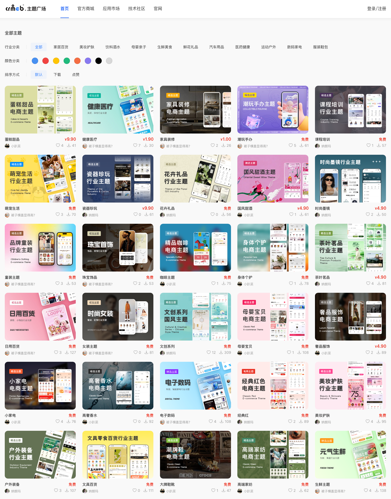
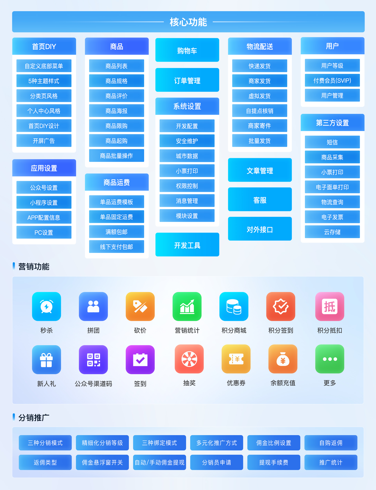
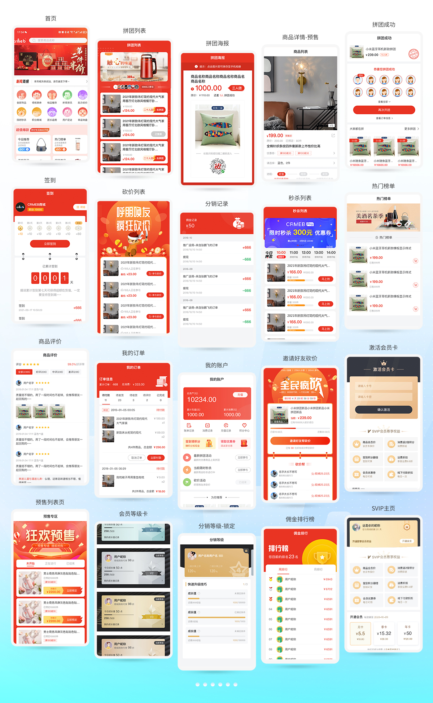
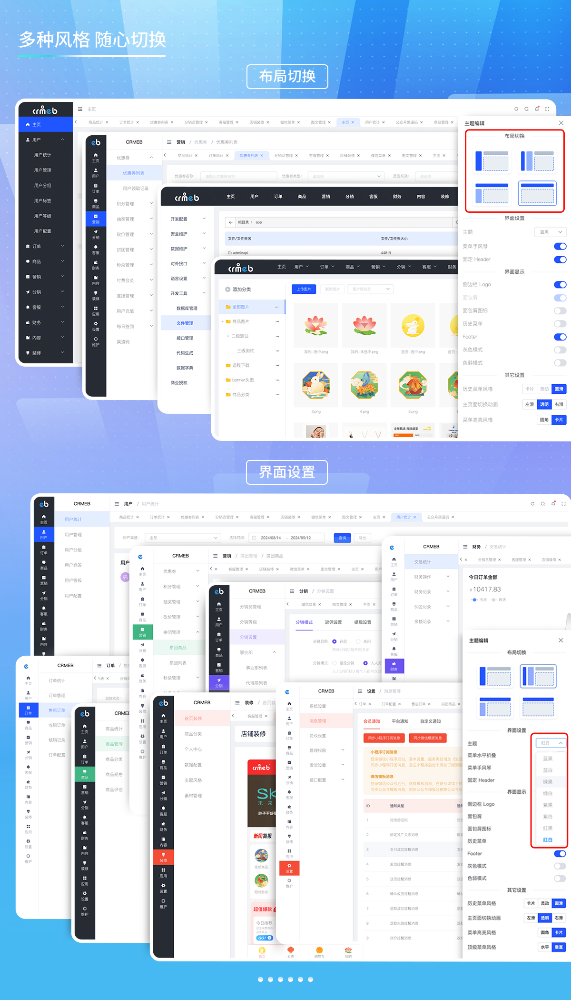
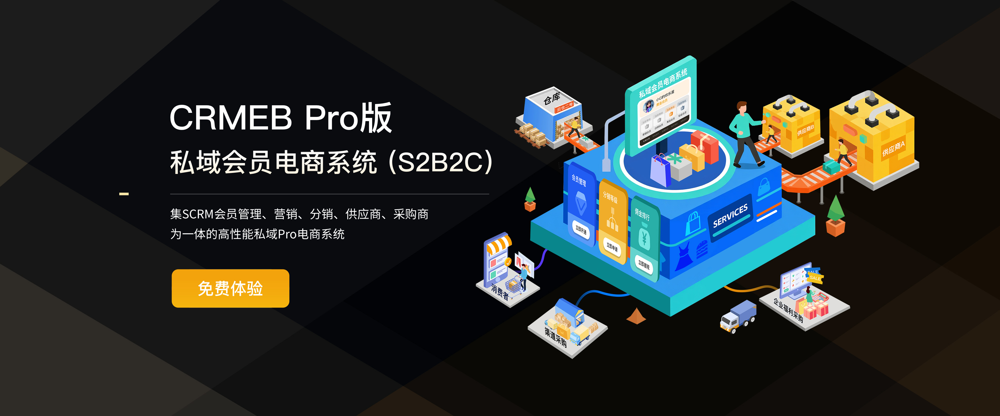
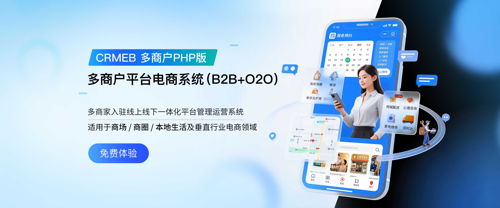

> **Bản Việt hóa CRMEB (v6.0.0)**
>
> - Giao diện quản trị, H5/App, trình cài đặt, thông báo API, dữ liệu mẫu SQL, chú thích code và tài liệu đã được dịch sang **tiếng Việt**.
>   - Ngôn ngữ mặc định: **vi-VN**. Múi giờ: **Asia/Ho_Chi_Minh**.
>   - Các gói ngôn ngữ khác vẫn còn và có thể bật lại trong trang quản trị.
>   - README tiếng Anh gốc: [`README_EN.md`](README_EN.md).
> - Đánh giá khả năng dùng CRMEB làm nền tảng TMĐT tại Việt Nam: [`PHAN_TICH_CRMEB_VIETNAM.md`](PHAN_TICH_CRMEB_VIETNAM.md).
> - Mã nguồn gốc thuộc bản quyền CRMEB (Xi'an Zhongbang). Văn bản license gốc giữ nguyên; bản dịch tham khảo nằm ở `crmeb/LICENSE.vi.txt`.
> - Build lại frontend:
>   - Admin: `cd template/admin && npm ci && NODE_OPTIONS=--openssl-legacy-provider npm run build`, sau đó chép `dist/` vào `crmeb/public/admin/`.
>   - UniApp: dùng HBuilderX như trước, hoặc build bằng uni-app CLI (Vue 2). Với H5, project CLI cần template `public/index.html` chuẩn của uni-app (có dòng nạp `static/index.<hash>.css`), nếu không trang sẽ thiếu CSS toàn cục.

<div align="center" >
    
</div>

<div align="center" style="font-size: 15px;">

Hệ thống thương mại điện tử mã nguồn mở chất lượng cao CRMEB (phiên bản PHP) 

</div>

<div align="center" >
    <a href='https://gitee.com/ZhongBangKeJi/CRMEB/stargazers'>
       </img>
    </a>
    <a href="http://www.crmeb.com/?from=giteephp">
        
    </a>
    <a href="http://www.crmeb.com">
        
    </a>
     <a href="https://gitee.com/ZhongBangKeJi/CRMEB/repository/archive/master.zip">
        
    </a>

</div>

<div align="center" style="font-size: 15px;">
  Chúng tôi tận tâm làm mã nguồn mở và rất cần sự khích lệ của bạn! Star🌟 ở góc trên bên phải đang chờ bạn thắp sáng
</div>

####

<div align="center">

Tiếng Việt | [English](./README_EN.md) 

</div>


####

<div align="center">

[![zread](https://img.shields.io/badge/Ask_Zread-_.svg?style=flat&color=00b0aa&labelColor=000000&logo=data%3Aimage%2Fsvg%2Bxml%3Bbase64%2CPHN2ZyB3aWR0aD0iMTYiIGhlaWdodD0iMTYiIHZpZXdCb3g9IjAgMCAxNiAxNiIgZmlsbD0ibm9uZSIgeG1sbnM9Imh0dHA6Ly93d3cudzMub3JnLzIwMDAvc3ZnIj4KPHBhdGggZD0iTTQuOTYxNTYgMS42MDAxSDIuMjQxNTZDMS44ODgxIDEuNjAwMSAxLjYwMTU2IDEuODg2NjQgMS42MDE1NiAyLjI0MDFWNC45NjAxQzEuNjAxNTYgNS4zMTM1NiAxLjg4ODEgNS42MDAxIDIuMjQxNTYgNS42MDAxSDQuOTYxNTZDNS4zMTUwMiA1LjYwMDEgNS42MDE1NiA1LjMxMzU2IDUuNjAxNTYgNC45NjAxVjIuMjQwMUM1LjYwMTU2IDEuODg2NjQgNS4zMTUwMiAxLjYwMDEgNC45NjE1NiAxLjYwMDFaIiBmaWxsPSIjZmZmIi8%2BCjxwYXRoIGQ9Ik00Ljk2MTU2IDEwLjM5OTlIMi4yNDE1NkMxLjg4ODEgMTAuMzk5OSAxLjYwMTU2IDEwLjY4NjQgMS42MDE1NiAxMS4wMzk5VjEzLjc1OTlDMS42MDE1NiAxNC4xMTM0IDEuODg4MSAxNC4zOTk5IDIuMjQxNTYgMTQuMzk5OUg0Ljk2MTU2QzUuMzE1MDIgMTQuMzk5OSA1LjYwMTU2IDE0LjExMzQgNS42MDE1NiAxMy43NTk5VjExLjAzOTlDNS42MDE1NiAxMC42ODY0IDUuMzE1MDIgMTAuMzk5OSA0Ljk2MTU2IDEwLjM5OTlaIiBmaWxsPSIjZmZmIi8%2BCjxwYXRoIGQ9Ik0xMy43NTg0IDEuNjAwMUgxMS4wMzg0QzEwLjY4NSAxLjYwMDEgMTAuMzk4NCAxLjg4NjY0IDEwLjM5ODQgMi4yNDAxVjQuOTYwMUMxMC4zOTg0IDUuMzEzNTYgMTAuNjg1IDUuNjAwMSAxMS4wMzg0IDUuNjAwMUgxMy43NTg0QzE0LjExMTkgNS42MDAxIDE0LjM5ODQgNS4zMTM1NiAxNC4zOTg0IDQuOTYwMVYyLjI0MDFDMTQuMzk4NCAxLjg4NjY0IDE0LjExMTkgMS42MDAxIDEzLjc1ODQgMS42MDAxWiIgZmlsbD0iI2ZmZiIvPgo8cGF0aCBkPSJNNCAxMkwxMiA0TDQgMTJaIiBmaWxsPSIjZmZmIi8%2BCjxwYXRoIGQ9Ik00IDEyTDEyIDQiIHN0cm9rZT0iI2ZmZiIgc3Ryb2tlLXdpZHRoPSIxLjUiIHN0cm9rZS1saW5lY2FwPSJyb3VuZCIvPgo8L3N2Zz4K&logoColor=ffffff)](https://zread.ai/crmeb/CRMEB)


</div>

<div align="center">

[Website chính thức](https://www.crmeb.com/?from=giteephp) |
[Trải nghiệm trực tuyến](http://v6.crmeb.net/admin/) |
[Tài liệu hướng dẫn](https://doc.crmeb.com/single_open) |
[Chợ ứng dụng](https://www.crmeb.com/market?from=giteephp) |
[Cộng đồng kỹ thuật](https://www.crmeb.com/ask/thread/list/147) |
[Kho giao diện](https://www.crmeb.com/theme) |
[Xem màn hình rộng](https://gitee.com/ZhongBangKeJi/CRMEB/blob/master/README.md)


</div>


---

### 📝 **Giới thiệu dự án**

**Mã nguồn mở tự do**

Mã nguồn của hệ thống thương mại điện tử mã nguồn mở CRMEB được công khai 100%, cho phép sử dụng thương mại miễn phí theo **giấy phép Apache-2.0**, không có bất kỳ chi phí ẩn hay giới hạn tính năng nào, thực sự mang lại khả năng triển khai “không tốn chi phí” và tự do phát triển tùy biến!

**Kiến trúc kỹ thuật**

Sử dụng bộ công nghệ **ThinkPHP 6 + ElementUI + UniApp**, thiết kế tách biệt frontend và backend, hỗ trợ phát triển theo module và bảo trì hiệu quả. Frontend tương thích nhiều nền tảng như WeChat Mini Program, H5, APP, PC, còn backend quản lý thống nhất dữ liệu của toàn bộ nền tảng, đảm bảo trải nghiệm mượt mà và hiệu năng xử lý đồng thời cao.

**Bao phủ mọi kịch bản**

Kết nối liền mạch OA WeChat, Mini Program, H5, APP và PC, dữ liệu liên thông theo thời gian thực, giúp người bán vận hành kinh doanh đa kênh tại một nơi, đáp ứng nhu cầu thương mại điện tử cho mọi kịch bản.

**Công cụ marketing tích hợp sẵn**

Tích hợp sẵn **20+ module marketing cốt lõi** (mua chung, săn giảm giá, flash sale, phiếu giảm giá, hệ thống điểm thưởng, livestream bán hàng, thành viên trả phí, thành viên theo hạng, nạp tiền tài khoản, tiếp thị liên kết lan truyền, mã kênh, quà tặng người mới, v.v.), hỗ trợ tùy chỉnh quy tắc chương trình khuyến mãi mà không cần plugin. Với **tính năng DIY trang chủ**, người bán có thể thiết kế trang chủ cửa hàng bằng thao tác kéo thả, nhanh chóng xây dựng các kịch bản có tỷ lệ chuyển đổi cao mà không cần kiến thức kỹ thuật, đạt hiệu quả vận hành theo kiểu “thấy gì được nấy”.

**Kế hoạch cùng xây dựng cộng đồng**

Chúng tôi cam kết xây dựng hệ sinh thái thân thiện với lập trình viên: công khai mã nguồn, liên tục cập nhật các module tính năng, đồng thời bổ sung Kho giao diện, cho phép người bán áp dụng các giao diện cửa hàng đẹp mắt chỉ với một cú nhấp để nhanh chóng thiết kế cửa hàng; lập trình viên và nhà thiết kế có thể đăng bán giao diện do mình sáng tạo để người dùng tải về sử dụng, qua đó chia sẻ sáng tạo và biến giá trị thành thu nhập. Đồng thời, chúng tôi hoan nghênh lập trình viên gửi đề xuất tối ưu hoặc đóng góp mã nguồn. Thông qua việc chia sẻ thành quả kỹ thuật, chúng tôi góp phần giảm chi phí “phát minh lại bánh xe” trong ngành, thúc đẩy sự phát triển bền vững của các hệ thống thương mại điện tử mã nguồn mở.

---

### 📝 **Kho giao diện**

**Tải xuống miễn phí**

Hãy đến Kho giao diện CRMEB để thỏa sức khám phá kho mẫu tuyển chọn khổng lồ, xây dựng cửa hàng mang dấu ấn riêng mà không tốn chi phí. Không cần năng lực thiết kế chuyên nghiệp, vô số mẫu miễn phí có thể tải về dùng ngay, phong cách giao diện đa dạng đáp ứng chính xác nhu cầu của từng ngành hàng, nhanh chóng nâng tầm hình ảnh cửa hàng và trải nghiệm người dùng, giúp cửa hàng của bạn chiếm ưu thế về thị giác ngay từ vạch xuất phát.

**Nhập bằng một cú nhấp**

Đơn giản hóa mọi thao tác, làm mới giao diện cửa hàng với tốc độ cực nhanh. Tạm biệt hoàn toàn quy trình cấu hình DIY thủ công rườm rà trước đây: chỉ cần nhập gói giao diện bằng một cú nhấp là toàn bộ giao diện (bao gồm bố cục trang và bảng màu toàn cục) sẽ được tích hợp liền mạch vào hệ thống của bạn. Hệ thống tự động khớp thành phần và gắn dữ liệu, không cần viết bất kỳ dòng mã nào, xem trước và áp dụng ngay lập tức. Việc thay đổi, nâng cấp giao diện cửa hàng trở nên dễ dàng như thay hình nền điện thoại, giúp tiết kiệm đáng kể thời gian và chi phí cho cả vận hành lẫn phát triển.

**Đăng bán trên Kho giao diện**

Không chỉ dùng thoải mái mà còn kiếm tiền dễ dàng. Bạn có thể tận dụng tính năng DIY mạnh mẽ của hệ thống, tự do kết hợp bảng màu, bố cục và thành phần dựa trên các module sẵn có để tạo ra giao diện độc quyền mang bản sắc riêng, rồi đăng bán trực tiếp trên Kho giao diện. Khi người dùng khác trả phí tải xuống tác phẩm của bạn, bạn sẽ nhận được phần chia sẻ doanh thu tương ứng. Điều này không chỉ mang lại kênh kiếm tiền trực tiếp từ năng lực thiết kế và kinh nghiệm kỹ thuật tích lũy của bạn, mà còn góp phần cùng xây dựng một hệ sinh thái cửa hàng trực tuyến mã nguồn mở thịnh vượng, tạo nên thành công kép cho cả sáng tạo lẫn giá trị.

Kho giao diện: <a href="https://www.crmeb.com/theme" target="_blank">Kho giao diện</a>





🔗 <a href="https://doc.crmeb.com/single_open/open_v60/39233" target="_blank">Danh sách tính năng</a> | 📩 <a href="https://gitee.com/ZhongBangKeJi/CRMEB/issues" target="_blank">Gửi phản hồi</a> | 📩 <a href="https://gitee.com/ZhongBangKeJi/CRMEB/pulls" target="_blank">Đóng góp mã nguồn</a> | 🔗 <a href="https://www.crmeb.com/theme" target="_blank">Kho giao diện</a>


---

### Trải nghiệm bằng docker chỉ với một lệnh
```
# Pull và chạy image Docker của CRMEB
docker run -d --name crmeb -p 8080:80 ccr.ccs.tencentyun.com/crmebky_php/crmebky:latest
```

#### Truy cập dịch vụ
- **Website**: http://localhost:8080 
- **Trang quản trị**: http://localhost:8080/admin (tài khoản: admin, mật khẩu: crmeb.com)
- **MySQL**: localhost:3306 (tài khoản: root, mật khẩu: 123456)
- **Redis**: localhost:6379
> Xem hướng dẫn chi tiết tại [Tài liệu hướng dẫn](/help/docker/docker.md).
---


### 🫧 Đặc điểm kỹ thuật

~~~
Về phát triển tùy biến:
1.Chuẩn mã nguồn: tuân thủ quy chuẩn đặt tên PSR-2, API theo chuẩn Restful, phân lớp mã nguồn chặt chẽ, chú thích đầy đủ, mã lỗi thống nhất;
2.Quản lý quyền: tích hợp sẵn cơ chế quản lý quyền mạnh mẽ, linh hoạt, có thể kiểm soát đến từng menu;
3.Cấu hình phát triển: thêm cấu hình theo hướng low-code, module dữ liệu tổ hợp của hệ thống;
4.Sinh mã: tạo nhanh menu và trang trong hệ thống quản trị, nhanh chóng hiện thực các thao tác thêm, xóa, sửa, tra cứu;
5.Tác vụ định kỳ: hệ thống tích hợp sẵn 10 loại tác vụ định kỳ, ngoài ra còn có tác vụ tùy chỉnh, có thể tự thiết lập chu kỳ thực thi và mã thực thi, tương thích hoàn hảo;
6.Sự kiện hệ thống: cài sẵn 30+ điểm neo sự kiện hệ thống, có thể thêm sự kiện ngay trên trang quản trị;
7.Chỉnh sửa trực tuyến: có thể chỉnh sửa mã nguồn hệ thống ngay trong trang quản trị mà không cần đăng nhập vào máy chủ để sửa tệp mã nguồn, tiện lợi và nhanh chóng;
8.Quản lý API: trang quản trị hiển thị toàn bộ dữ liệu API trong hệ thống, đồng thời cho phép gỡ lỗi API trực tuyến;
9.Hiệu quả phát triển tùy biến: sử dụng form-builder PHP để tạo biểu mẫu nhanh chóng;
10.Nhanh chóng làm quen: quản lý API trong trang quản trị, từ điển cơ sở dữ liệu trong trang quản trị, ghi chú quản lý tệp hệ thống, chú thích mã nguồn, cài đặt bằng một cú nhấp;
~~~
~~~
Hiệu năng và khả năng mở rộng:
1.Bảo mật hệ thống: nhật ký thao tác hệ thống, nhật ký vận hành hệ thống, kiểm tra tệp, sao lưu dữ liệu;
2.Hiệu năng cao: hỗ trợ bộ nhớ đệm Redis, hàng đợi, kết nối liên tục, nhiều loại lưu trữ đám mây, hỗ trợ triển khai dạng cụm (cluster);
3.Đa ngôn ngữ: hỗ trợ tự động nhận diện ngôn ngữ của trình duyệt để hiển thị đa ngôn ngữ;
4.Mở rộng driver: hỗ trợ nhiều phương thức thanh toán, nhiều nhà cung cấp SMS, nhiều dịch vụ lưu trữ đám mây, v.v.;
5.Lưu trữ đám mây: hỗ trợ lưu trữ hình ảnh và video từ xa trên đám mây, hỗ trợ Alibaba Cloud, Tencent Cloud, Qiniu Cloud, JD Cloud, Tianyi Cloud, Huawei Cloud
6.Yihaotong: tiện ích mở rộng bên thứ ba dùng chung, hỗ trợ SMS, tra cứu vận chuyển, vận đơn điện tử, hóa đơn điện tử, thu thập sản phẩm, người bán gửi hàng
~~~

---

### 📖 Tính năng hệ thống



---

### 📖 Minh họa giao diện UI




---

### 📖 Minh họa giao diện trang quản trị




---


### 📱 Demo hệ thống


Trang quản trị: http://v6.crmeb.net/admin

Tài khoản: demo Mật khẩu: crmeb.com

Bản H5: http://v6.crmeb.net/ (mở trên thiết bị di động)

Bản PC: http://v6.crmeb.net/ (mở trên máy tính)

Tải APP: http://app.crmeb.cn/bzv (với iPhone, tìm CRMEB trực tiếp trên APP Store để tải về)

Giao diện: https://www.crmeb.com/theme (mở trên máy tính)

> Nghe nói cao thủ như bạn muốn xem toàn bộ khung kiến trúc của dự án mã nguồn mở CRMEB? <a href="https://doc.crmeb.com/single_open/open_v60/39235" target="_blank">Nhấn vào đây để nhận ngay!</a>


---


### 🔐 **Môi trường vận hành**


| **Môi trường vận hành**         | **Yêu cầu**                                                                 |
|------------------|------------------------------------------------------------------------|
| **Hệ điều hành**     | Linux / Windows                                                        |
| **Máy chủ WEB**   | Nginx / Apache / IIS                                                      |
| **Phiên bản PHP**     | PHP 7.1 ~ 7.4                                                          |
| **Cơ sở dữ liệu**       | MySQL 5.7 ~ 8.0 (engine: InnoDB)                                         |
| **Bộ nhớ đệm**         | Redis (tùy chọn, nếu không cài đặt sẽ dùng bộ nhớ đệm bằng tệp)                                      |
| **Trình quản lý**       | Supervisor (dùng để quản lý hàng đợi tin nhắn)                                          |
| **Công cụ khuyên dùng**     | BT Panel (đơn giản, dễ sử dụng)                                                    |
| **Máy chủ đám mây**     | Alibaba Cloud ECS / Tencent Cloud CVM / JD Cloud ECS                                                |
| **Cổng cần mở**     | 80, 21, 8888, 888, 443, 3306, 6379 (đối tượng cấp quyền: `0.0.0.0/0`)              |
| **Tiện ích mở rộng PHP**     | fileinfo (tùy chọn), redis (tùy chọn)                               |
| **Hàm cần bỏ vô hiệu hóa**     | `proc_open`, `pcntl_signal`, `pcntl_signal_dispatch`, `pcntl_fork`, `pcntl_wait`, `pcntl_alarm` |
| **Hàng đợi tin nhắn**     | Lệnh chạy: `php think queue:listen --queue`    (dùng Supervisor)                          |
| **Kết nối liên tục**       | Lệnh chạy: `sudo -u www php think workerman start --d`     (chạy bằng dòng lệnh)              |
| **Tác vụ định kỳ**     | Lệnh chạy: `php think timer start --d`            (chạy bằng dòng lệnh)                       |
> Lưu ý: không hỗ trợ hosting ảo, khuyên dùng BT Panel (Baota), về máy chủ khuyên dùng máy chủ JD Cloud: <a href="https://partner.jdcloud.com/partner/notice/b06c3232b6394fdfa496923b8e00b286" target="_blank">Đăng ký là được hưởng ưu đãi độc quyền giảm 35%, nhấn vào đây để nhận!</a>

---
### 📺 **Môi trường phát triển và công nghệ sử dụng**

### **Môi trường phát triển:**
| Công cụ          | Phiên bản               | Liên kết tải xuống                                                                 |
|--------------|--------------------|-------------------------------------------------------------------------|
| **PHP**      | 7.1-7.4            | [Tải PHP từ trang chính thức](https://www.php.net/downloads.php)                           |
| **MySQL**    | 5.7                | [Website chính thức MySQL](https://www.mysql.com/)                                       |
| **Redis**    | 7.0                | [Website chính thức Redis](https://redis.io/download)                                     |
| **Nginx**    | 1.22               | [Website chính thức Nginx](http://nginx.org/en/download.html)                             |
| **Apache**   | 2.4                | [Apache HTTP Server](https://httpd.apache.org/download.cgi)              |
| **Node.js**  | 14/18              | [Node.js phiên bản LTS](https://nodejs.org/en/download/releases/)                |

### Bộ công nghệ backend
| **Công nghệ**            | **Tên**                                                                 | **Địa chỉ web**                                                                 |
|---------------------|-----------------------------------------------------------------------------|-------------------------------------------------------------------------|
| Thư viện mở rộng php          | Môi trường chạy cơ bản của PHP, xử lý dữ liệu JSON, tính toán số học độ chính xác cao, v.v.                                | https://www.php.net/                                                   |
| topthink          | Template engine cho view của ThinkPHP, thành phần tạo mã xác thực (captcha), hỗ trợ tác vụ hàng đợi, công cụ migration cơ sở dữ liệu                 | https://www.thinkphp.cn/                     |
| overtrue          | Phát triển cho hệ sinh thái WeChat (OA WeChat/Mini Program/thanh toán)                                               | https://github.com/w7corp/easywechat                                     |
| php-jwt           | Tạo và xác thực token JWT                                                             | https://github.com/firebase/php-jwt                                    |
| var-dumper        | Công cụ xuất thông tin gỡ lỗi (định dạng biến)                                                     | https://symfony.com/doc/current/components/var_dumper.html            |
| phpoffice         | Xử lý tệp                                                                    | https://github.com/PHPOffice/PhpSpreadsheet                           |
| guzzlehttp｜psr7  | Thư viện HTTP client, triển khai interface thông điệp HTTP theo PSR-7                                        | https://guzzle-cn.readthedocs.io/zh-cn/latest                        |
| form-builder      | Công cụ UI giúp xây dựng biểu mẫu nhanh chóng                                                      | https://form-create.com                                  |
| workerman         | Framework máy chủ Socket hiệu năng cao, lập lịch tác vụ định kỳ                                        | https://www.workerman.net                                   |

### Bộ công nghệ phía di động
| **Công nghệ** | **Tên** | **Website chính thức** |
| --- | --- | --- |
| uniapp | Framework đa nền tảng | https://uniapp.dcloud.net.cn/ |
| vuex | Thư viện quản lý trạng thái | https://vuex.vuejs.org/ |
| socket | Giao tiếp WebSocket | https://socket.io/ |
| dayjs | Thư viện xử lý thời gian | https://day.js.org/ |
| animate | Thư viện hiệu ứng động CSS | https://animate.style/ |
| easy-loadimage | Tải ảnh trì hoãn (lazy load) | https://github.com/TSjianjiao/easy-loadimage |

### Bộ công nghệ phía Admin
| **Công nghệ** | **Tên** | **Website chính thức** |
| --- | --- | --- |
| vue2 | Framework Vue | https://v2.vuejs.org/ |
| vuex | Thư viện quản lý trạng thái | https://vuex.vuejs.org/ |
| element-ui | Framework UI | https://element.eleme.io/ |
| axios | HTTP client | https://axios-http.com/ |
| vxe-table | Thành phần bảng nâng cao | https://vxetable.cn/ |
| wangeditor | Trình soạn thảo văn bản định dạng | https://www.wangeditor.com/ |
| qs | Phân tích chuỗi truy vấn (query string) | https://github.com/ljharb/qs |
| xlsx | Thư viện xử lý Excel | https://sheetjs.com/ |
| sass | Bộ tiền xử lý CSS | https://sass-lang.com/ |
| prettier | Định dạng mã nguồn | https://prettier.io/ |
| v-viewer | Trình xem ảnh | https://github.com/mirari/v-viewer |

### Bộ công nghệ phía PC
| **Công nghệ** | **Tên** | **Website chính thức** |
| --- | --- | --- |
| nuxt | Framework render phía máy chủ (SSR) cho Vue | https://nuxtjs.org/ |
| element | Framework UI | https://element.eleme.io/ |
| axios | HTTP client | https://axios-http.com/ |
| sass | Bộ tiền xử lý CSS | https://sass-lang.com/ |
| cookie-universal-nuxt | Xử lý Cookie cho Nuxt | https://github.com/microcipcip/cookie-universal |
| postcss | Công cụ chuyển đổi CSS | https://postcss.org/ |
| qs | Phân tích chuỗi truy vấn (query string) | https://github.com/ljharb/qs |


### Muốn cài đặt nhanh, đã có hướng dẫn hỗ trợ!

Cài đặt và triển khai nhanh bằng một cú nhấp: https://doc.crmeb.com/single_open/open_v54/20366

Cài đặt với cấu hình thủ công: https://doc.crmeb.com/single_open/open_v54/20389

Triển khai bằng một cú nhấp với docker-compose: https://doc.crmeb.com/single_open/open_v54/20145

Cài đặt bằng một cú nhấp trên môi trường BT Panel: https://doc.crmeb.com/single_open/open_v54/19892

### Hỗ trợ phát triển tùy biến:
Tài liệu sử dụng: https://doc.crmeb.com/single_open/open_v54/19849

Tài liệu API: https://doc.crmeb.com/single_open/open_v54/21040

Từ điển dữ liệu: https://doc.crmeb.com/single_open/open_v54/20136

Sinh mã: https://doc.crmeb.com/single_open/open_v54/20135

Tài liệu phát triển tùy biến: https://doc.crmeb.com/single_open/open_v54/19851

Video hướng dẫn: https://www.bilibili.com/video/BV1kh4y1872K/

Cộng đồng kỹ thuật: https://www.crmeb.com/ask/thread/list/147

---

###  📞 Tương tác cùng CRMEB
#### Nhóm trao đổi kỹ thuật mã nguồn mở CRMEB (quét mã để vào nhóm và nhận tài liệu API bản mã nguồn mở, danh sách tính năng sản phẩm, sơ đồ tư duy!)

#### Cộng đồng kỹ thuật! Tìm giải pháp, báo bug, xem tin tức chính thức, nhận giải thưởng lớn cho thành viên tích cực! <a href="https://www.crmeb.com/ask/?from=giteephp" target="_blank">Cộng đồng kỹ thuật CRMEB</a> có đầy đủ tất cả


---

❤️ Lấy thương mại làm bệ đỡ, bảo vệ trái tim mã nguồn mở

### 📕 Dựng nhanh cửa hàng Mini Program của bạn trong 2 giờ

[](https://shop.crmeb.com)

### 📕 Hệ thống thương mại điện tử thành viên chuyên nghiệp cho tệp khách hàng riêng

[](https://www.crmeb.com/index/pro?from=giteephp)


### 📕 Xây dựng sàn thương mại? Khuyên dùng hệ thống đa người bán tối ưu chi phí

[](https://www.crmeb.com/index/merchant?from=giteephp)

---


[Về đầu trang :fa-arrow-circle-up: ](https://gitee.com/ZhongBangKeJi/CRMEB#%E9%A1%B9%E7%9B%AE%E4%BB%8B%E7%BB%8D)

