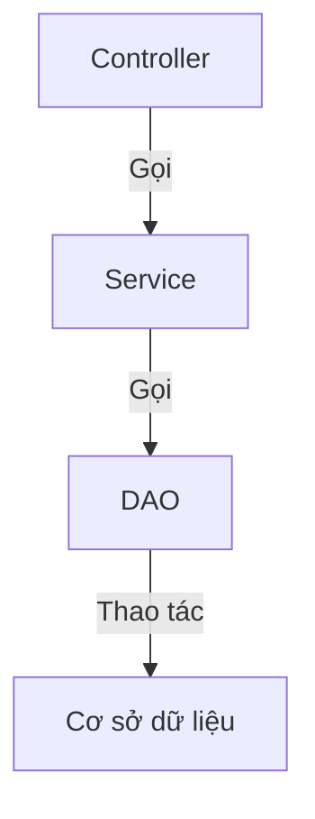

# Hướng dẫn AI đọc hiểu mã nguồn

## 🧠 Phương pháp luận đọc hiểu code

### 1. Phương pháp hiểu theo từng tầng
- **Tầng kiến trúc**: Hiểu cấu trúc tổng thể của dự án và bộ công nghệ
- **Tầng module**: Phân tích cách phân chia module chức năng và quan hệ tương tác giữa chúng
- **Tầng lớp (class)**: Nghiên cứu trách nhiệm và interface của các lớp cốt lõi
- **Tầng phương thức**: Hiểu logic triển khai của từng phương thức cụ thể

### 2. Truy vết chuỗi lời gọi (call chain)


### 3. Liên kết ngữ cảnh
- Truy ngược lên trên: Phương thức này được ai gọi?
- Đi sâu xuống dưới: Phương thức này gọi những phương thức nào khác?
- Liên kết theo chiều ngang: Có phương thức nào khác có chức năng tương tự không?

## 🔍 Phân tích code cốt lõi

### 1. Tầng controller
```php
// Phương thức controller điển hình
public function createOrder() {
    // 1. Xác thực tham số
    $params = $this->request->post();
    $this->validate($params);

    // 2. Gọi tầng service
    $orderId = $orderService->createOrder($params);

    // 3. Trả về kết quả
    return $this->success(['order_id' => $orderId]);
}
```

### 2. Tầng service
```php
// Phương thức service điển hình
public function createOrder($params) {
    // 1. Kiểm tra sản phẩm
    $this->checkProducts($params['products']);

    // 2. Tính giá
    $amount = $this->calculateAmount($params);

    // 3. Tạo đơn hàng
    $orderId = $this->orderDao->create([
        'user_id' => $params['user_id'],
        'amount' => $amount,
        'status' => 'unpaid'
    ]);

    // 4. Trừ tồn kho
    $this->productService->deductStock($params['products']);

    return $orderId;
}
```

### 3. Tầng DAO
```php
// Phương thức DAO điển hình
public function create($data) {
    $data['create_time'] = time();
    return Db::name('order')->insertGetId($data);
}
```

## 📚 Lộ trình học code

### 1. Lộ trình nhập môn
1. Hiểu luồng nghiệp vụ bắt đầu từ controller
2. Theo dõi phần triển khai ở tầng service của nghiệp vụ cốt lõi
3. Tìm hiểu các thao tác truy cập dữ liệu cơ bản

### 2. Lộ trình nâng cao
1. Nghiên cứu cơ chế xử lý ngoại lệ
2. Phân tích cách triển khai middleware
3. Hiểu cơ chế sự kiện và lắng nghe sự kiện (listener)

### 3. Lộ trình chuyên sâu
1. Nghiên cứu các điểm tối ưu hiệu năng
2. Phân tích các biện pháp bảo vệ an ninh
3. Hiểu cơ chế mở rộng

## 💡 Mẹo đọc hiểu

### 1. Mẹo debug
```php
// Dùng log để in ra các biến quan trọng
Log::info('Order create params: ' . json_encode($params));

// Dùng breakpoint để debug
xdebug_break();
```

### 2. Công cụ trực quan hóa
- Dùng công cụ UML để vẽ sơ đồ lớp
- Dùng sơ đồ tuần tự để mô tả luồng gọi
- Dùng sơ đồ tư duy để sắp xếp các module chức năng

### 3. Hỗ trợ từ tài liệu
- Kết hợp tài liệu API để hiểu tham số
- Tham khảo từ điển cơ sở dữ liệu để hiểu cấu trúc dữ liệu
- Xem các test case để nắm được hành vi mong đợi

## 🛠️ Giải quyết các vấn đề thường gặp

### 1. Làm sao để nhanh chóng xác định vị trí logic nghiệp vụ?
- Tìm kiếm từ khóa liên quan (như tên phương thức, tên bảng)
- Theo dõi sự thay đổi của các bảng dữ liệu cốt lõi
- Phân tích chuỗi lời gọi trong log

### 2. Làm sao để hiểu thuật toán phức tạp?
- Chia nhỏ thành từng bước và kiểm chứng dần
- Viết unit test để kiểm chứng các điều kiện biên
- Dùng công cụ trực quan hóa để thể hiện luồng dữ liệu

### 3. Làm sao để đánh giá chất lượng code?
- Kiểm tra việc phân tầng có rõ ràng không
- Đánh giá độ bao phủ của unit test
- Phân tích mức độ trùng lặp code
- Kiểm tra xử lý ngoại lệ đã đầy đủ chưa

---

> **Lưu ý**: Tài liệu này do AI tạo ra, chỉ mang tính tham khảo.
